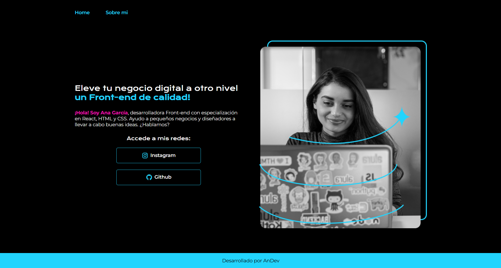
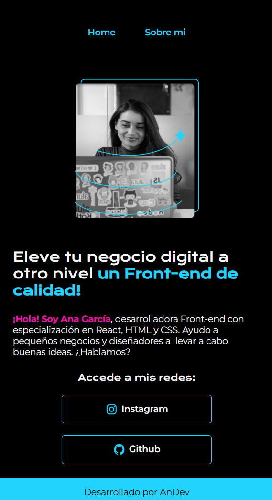

# Portafolio Ejemplo

Este proyecto fue realizado como parte del curso de **HTML y CSS: trabajando con responsividad y publicación de proyectos** de **Alura Latam**, dentro del programa **ONE - Oracle Next Education**.

El objetivo fue construir un portafolio personal aplicando conceptos clave de HTML, CSS y diseño responsivo mientras se avanzaba en el curso.

## Descripción

- Portafolio desarrollado como ejemplo práctico a lo largo del curso.
- Al finalizar el curso, el proyecto quedó publicado en su estado actual.
- Diseñado para ser una introducción clara y profesional al desarrollo web responsivo.

## Características

- **Diseño Responsivo**: Adaptado para computadoras, tablets y smartphones.
- **Organización Clara**: Código estructurado y formateado para facilitar su lectura.
- **Desarrollo Progresivo**: Construido mientras se aprendían nuevos conceptos en el curso.

## Tecnologías Utilizadas

- **HTML5**
- **CSS3**

## Capturas de Pantalla

### Vista en PC


### Vista en Móvil


## Cómo Visualizar el Proyecto

1. Clona este repositorio en tu máquina local:
   ```bash
   git clone https://github.com/AnDev-000/portafolio-ejemplo.git
